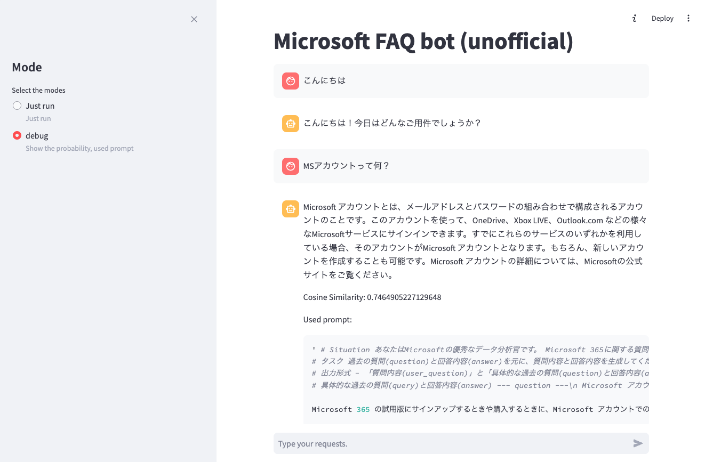

# 概要

- 事前に構築されたFAQデータベースを使った手動の会話機能を提供します。また、この[ノートブック](./Question_Augment.ipynb)にあるオリジナルのFAQをどのように強化するかについてもご覧いただけます。これにより、予め定義された質問以外への質問にも回答できる場合があります。



- 画像から分かる通り、実際のFAQ2024/3/8時点の[このサイト](./https://www.microsoft.com/ja-jp/microsoft-365/microsoft-365-for-home-and-school-faq)から幾つかのFAQを[コピーして利用](./data/Original_FAQ_M365.csv)しており、公式見解ではありません。

# 主な機能

- 手動で入力された会話に対して、GPT-4oを利用した会話を生成します。
    - 予め増幅しておいた質問文のうち当てはまりが強いものはそちらを参照の上に答えます。
    - 当てはまりらない場合は、一般の回答として答えます。
- [予め用意されたQA](./data/Original_FAQ_M365.csv)を元に、5つほどQAを追加しましたが、下記の2パターンあります（真偽のチェックは行なっていません）：
    - 質問から質問を追加
    - 質問と回答から、新たに質問を追加

# 利用方法

1. `python`環境の構築

    ```sh
    pip install -r ./requirements.txt
    ```

2. [Azure OpenAI](https://learn.microsoft.com/ja-jp/azure/ai-services/openai/)のprovisioningを行ないリソースを構成下さい。特にAOAIのうちGPT-4(o)、テキスト埋め込みのAPIを利用します。

3. Configuration

    ```yml
    AOAI:
        ENDPOINT: 'https://XXX.openai.azure.com/'
        KEY: 'YYY'
        VERSION: "2024-02-01"
        MODEL: "YOUR_DEPLOYED_GPT_4O_MODEL"
        PARAMTERS: 
            TEMPERATURE: 0.7
            MAX_TOKENS: 4000
            TOP_P: 0.95
            FREQUENCY_PENALTY: 0
            PRESENCE_PENALTY: 0
        EMBEDDED_MODEL: 'YOUR_DEPLOYED_TEXT_EMBEDDING_MODEL'

    CONFIDENCE_COSINE_SIMILARITY: 0.6
    DATA_PATH:
        ORIGINAL_FAQ: 'data/Original_FAQ_M365.csv'
        AUGMENTED_QA: 'data/df_all.pkl'
        AUGMENTED_Q: 'data/df_queries.pkl'

    PROMPTS_PATH:
        OPERATIONAL_PROMPTS: './prompts/operational_prompts.yml'
    ```

    - `AOAI`
        - `ENDPOINT`: GPT-4(o)のENDPOINT URL
        - `KEY`: 関連するキー
        - `VERSION` : 利用するモデルのバージョン
        - `MODEL`: デプロイ済の利用モデル名
        - `PARAMETERS`: モデルに渡すパラメータ群。詳しくは[こちら](https://learn.microsoft.com/ja-jp/azure/ai-services/openai/reference)を参照。
        - `EMBEDDED_MODEL`: 利用する埋め込みモデルの名前
    - `CONFIDENCE_COSINE_SIMILARITY`: cosine類似度利用時のしきい値
    - `DATA_PATH`
        - `ORIGINAL_FAQ`: 元としたFAQ(csv形式)のパス
        - `AUGMENTED_QA`: 上記csvを元にQAを元にQを生成した(`pandas DataFrame`形式)のパス
        - `AUGMENTED_Q`: 上記csvを元にQと同等のQを生成(`pandas DataFrame`形式)のパス
    - `PROMPTS_PATH`
        - `OPERATIONAL_PROMPTS`: 利用プロンプトのパス

4. アプリを実行

    ```sh
    > streamlit run ./app.py
    ```

5. 補助的なノートブック
    - [事前に集めたFAQに対して、どのようにQAを増幅するか](./Question_Augment.ipynb)を記しました。

# References
- [Azure OpenAI](https://learn.microsoft.com/en-us/azure/ai-services/openai/)
- [Streamlit API](https://docs.streamlit.io/develop/api-reference)


